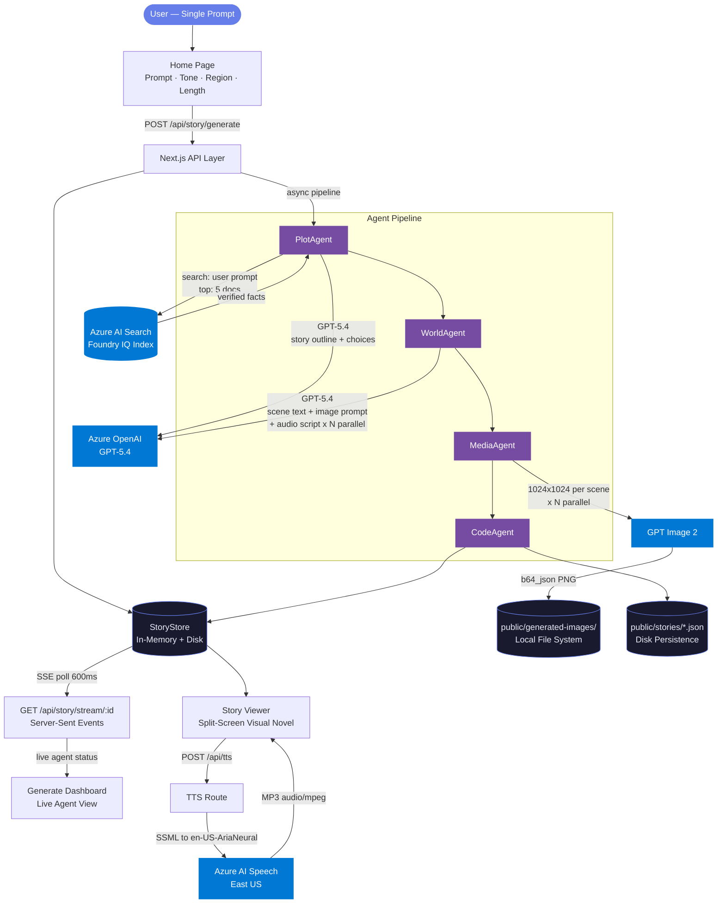

<div align="center">
  

  # ✦ Narrative Alchemist

  ### *One prompt in. A fully playable, illustrated, narrated visual novel out — in under 60 seconds.*

  [](https://azure.microsoft.com/)
  [](https://azure.microsoft.com/en-us/products/ai-services/ai-search)
  [](https://nextjs.org/)
  [](https://www.typescriptlang.org/)
  [](https://azure.microsoft.com/en-us/products/ai-services/openai-service)
  [](https://github.com/features/copilot)
  [](https://microsoft.com/)
  [](https://opensource.org/licenses/MIT)

</div>

---

## 🌟 Introduction

**Narrative Alchemist** is a multi-agent creative AI platform built for the **Microsoft Agents League Hackathon 2026 — Creative Apps Track**.

It solves the most fundamental creative bottleneck: turning a raw story idea into something *playable* — with illustrations, voice narration, and branching choices — normally takes days of work across disconnected tools. Narrative Alchemist collapses that entire production pipeline into **a single sentence and 60 seconds**, using four specialized Azure AI agents that each own one layer of the creative stack and hand off to each other automatically.

> **Foundry IQ** is at the core of every story. Before a single word of prose is generated, PlotAgent queries the Azure AI Search knowledge index to retrieve verified real-world facts. Those facts are woven into the narrative and surfaced to users as cited **Agent Insights** on every scene — so every story is grounded in knowledge, not hallucinated from thin air.

The output isn't a document. It isn't an image gallery. It's a fully playable **branching visual novel** — complete with AI-generated scene illustrations, professional neural voice narration, real-world fact grounding via Azure AI Search, and interactive story choices — all from one prompt.

---

## 📋 Table of Contents

1. [Introduction](#-introduction)
2. [The Problem](#️-the-problem)
3. [Our Solution](#-our-solution)
4. [Agent Pipeline](#-agent-pipeline)
5. [Key Features](#-key-features)
6. [System Architecture](#️-system-architecture)
7. [Technology Stack](#️-technology-stack)
8. [Quick Start](#-quick-start)
9. [Project Screenshots](#-project-screenshots)
10. [Responsible AI](#-responsible-ai)
11. [Team](#-team)
12. [License](#-license)

---

## ⚠️ The Problem

Creating an immersive interactive story experience traditionally requires:

- A **writer** — hours of drafting, scene structure, prose editing
- An **illustrator** — concept art, scene composition, artwork per scene
- A **narrator** — voice recording, audio editing, mixing
- A **developer** — building the interactive layer, choices, and state

Even with today's AI tools, these steps are still disconnected. A creator prompts for text in one tool, images in another, handles audio separately, and manually builds the interactive wrapper. The overhead of coordinating this — and the cost of producing even three polished scenes — puts rich interactive storytelling completely out of reach for most educators, indie game designers, and storytellers, especially in emerging markets where production resources are limited.

---

## 💡 Our Solution

Narrative Alchemist replaces that fragmented multi-tool workflow with a **single coordinated agent pipeline** where each agent owns exactly one layer of the creative stack.

The user enters one sentence. The system handles the rest:

- **Story structure** — grounded in verified real-world knowledge from Azure AI Search
- **Immersive scene prose** — 180–220 word scenes in second-person, present tense
- **Scene illustrations** — full 1024×1024 AI-generated artwork per scene via GPT Image 2
- **Neural narration** — professional Azure AI Speech, not browser TTS
- **Playable interface** — branching visual novel with 3D page-flip animation and choice navigation

The pipeline runs **entirely on Azure** — four Microsoft AI services coordinated through a Next.js server, with live progress streamed to the browser in real time via Server-Sent Events.

---

## 🤖 Agent Pipeline

| # | Agent | What It Does | Azure Service |
|:--|:------|:-------------|:--------------|
| 1 | **PlotAgent** | Queries the Foundry IQ knowledge base, retrieves verified facts, generates story outline with title, scenes, and choices | Azure AI Search + Azure OpenAI GPT-5.4 |
| 2 | **WorldAgent** | Expands each scene in parallel: immersive prose + image prompt + audio narration script | Azure OpenAI GPT-5.4 |
| 3 | **MediaAgent** | Generates one 1024×1024 scene illustration per scene, saves locally | GPT Image 2 |
| 4 | **CodeAgent** | Assembles the complete typed `StoryBundle`, persists to disk, sets status to complete | In-process orchestration |

---

## ✨ Key Features

### 🔴 Live Agent Pipeline Dashboard
Watch all four agents complete in real time via **Server-Sent Events**. Each agent displays its status (Pending → Running → Done), a live progress bar fills from 0–100%, and scene illustrations appear in the asset panel as MediaAgent completes them. No loading spinners — live orchestration, visible to judges.

### 🎨 GPT Image 2 Scene Illustrations
Every scene gets a unique AI-generated illustration via **GPT Image 2** — full 1024×1024 artwork tailored to the scene's mood, setting, characters, and narrative tone.

### 🔊 Azure Neural TTS Narration
Click the narrate button on any scene to hear it read aloud by **Azure AI Speech (Aria Neural)**. The `/api/tts` route calls the Azure Speech endpoint server-side and streams the MP3 back to the browser — professional quality neural narration, not browser text-to-speech.

### 🔍 Foundry IQ Knowledge Grounding
Before PlotAgent writes a single word, it queries the **Azure AI Search** Foundry IQ index to retrieve verified real-world facts about the story's setting. Those facts are woven into the narrative and surfaced as **Agent Insights** citations in the story viewer — so every story is grounded, not hallucinated.

### 📖 Split-Screen Visual Novel with Page-Flip Animation
The story viewer is a full-viewport split screen: AI illustration on the left, narrative text and choices on the right. A **3D CSS perspective page-flip animation** plays on every scene transition, scene dot navigation tracks progress, and the "Agent Insights" panel opens to show Foundry IQ citations per scene.

### 🌗 Light / Dark Mode
Full theme toggle backed by CSS custom properties and localStorage persistence. Every color in the UI adapts — no hardcoded values, no flash of wrong theme.

### 📚 Story Library
All generated stories persist across sessions. The library shows cover art, tone and region tags, filtering by tone and region, and lets you replay any story or download its full `StoryBundle` as JSON.

---

## 🏛️ System Architecture

<div align="center">
  
  <br/><br/>
  
</div>

> Full Mermaid diagrams (5 views: system overview, agent sequence, data model, Azure service map, route map) in [docs/ARCHITECTURE.md](docs/ARCHITECTURE.md).



---

## 🛠️ Technology Stack

| Category | Technology / Azure Service |
|:---------|:--------------------------|
| **Framework** | Next.js 16.1.6 — App Router, Turbopack |
| **Language** | TypeScript 5, React 19 |
| **Styling** | Custom SCSS design system, CSS custom properties |
| **Story Intelligence** | Azure OpenAI — GPT-5.4 |
| **Image Generation** | GPT Image 2 (`api-version=2025-04-01-preview`) |
| **Knowledge Grounding** | Azure AI Search — Foundry IQ indexed knowledge base |
| **Neural Narration** | Azure AI Speech — `en-US-AriaNeural` |
| **Real-Time Streaming** | Server-Sent Events — ReadableStream via Next.js API routes |
| **Storage** | In-memory singleton + JSON disk persistence + local PNG serving |
| **Auth / Session** | NextAuth |

---

## 🚀 Quick Start

### Prerequisites
- Node.js 20+
- npm 10+
- Azure subscription with OpenAI, AI Search, and Speech services provisioned

### Installation

**1. Clone the repository:**
```bash
git clone https://github.com/10ANT/narrative-alchemist.git
cd narrative-alchemist
```

**2. Install dependencies:**
```bash
npm install --legacy-peer-deps
```

**3. Configure environment variables** — create `.env.local` in the project root:
```env
AZURE_OPENAI_ENDPOINT=https://your-resource.cognitiveservices.azure.com
AZURE_OPENAI_API_KEY=your-key
AZURE_OPENAI_DEPLOYMENT=gpt-5.4
AZURE_OPENAI_API_VERSION=2025-04-01-preview

AZURE_IMAGE_ENDPOINT=https://your-resource.cognitiveservices.azure.com/openai/deployments/gpt-image-2/images/generations?api-version=2025-04-01-preview
AZURE_IMAGE_API_KEY=your-key

AZURE_SEARCH_ENDPOINT=https://your-search.search.windows.net
AZURE_SEARCH_API_KEY=your-key
AZURE_SEARCH_INDEX_NAME=your-index-name

AZURE_TTS_KEY=your-speech-key
AZURE_TTS_REGION=eastus

NEXTAUTH_SECRET=any-random-secret
NEXTAUTH_URL=http://localhost:3000
```

**4. Start the development server:**
```bash
npm run dev
```

**5. Open your browser** and navigate to `http://localhost:3000`

---

## 📸 Project Screenshots

<div align="center">

**Home — Story Creator** · *Prompt form with tone, region, and length configuration*


**Generate — Live Agent Pipeline** · *Four agents completing in real time via SSE*


**Story Viewer — Dark Mode** · *Split-screen visual novel with GPT Image 2 illustration*


**Story Library** · *Persistent story grid with tone and region filtering*


</div>

---

## 🤝 Responsible AI

Narrative Alchemist is built with responsible AI principles at every layer:

- 🔗 **Grounding over hallucination** — PlotAgent always queries Azure AI Search before generating. The Foundry IQ knowledge index provides verified real-world facts woven into every story. Facts are cited in the "Agent Insights" panel on every scene so users can see exactly what grounded the narrative.
- 👁️ **Transparency** — The Agent Pipeline Dashboard shows every agent running in real time, with the Azure service each agent calls clearly labeled. Users see the full pipeline, not a black box.
- ♿ **Accessible narration** — Azure Neural TTS (Aria Neural) ensures every story can be heard as well as read, making the platform accessible regardless of reading ability or visual impairment.
- 🛡️ **Content boundaries** — Story generation operates within system-prompt guardrails ensuring age-appropriate, culturally respectful narrative output across all tones and regions.
- 📦 **Explainability** — Every completed story is exportable as a typed JSON bundle (`StoryBundle`) containing all agent outputs, image paths, audio scripts, Foundry IQ citations, and generation metadata — fully auditable.

---

## 👥 Team

<div align="center">

| **Adrian Tennant** |
|:---:|
| [](https://github.com/10ANT) |
| Full-Stack Developer · AI Engineer |

</div>

---

## 🤖 AI-Assisted Development

Narrative Alchemist was built using **AI-assisted development tools** throughout — from initial architecture to production edge cases.

| Phase | AI Assistance Applied |
|:------|:----------------------|
| **Agent design** | AI tools drafted the typed `StoryBundle` / `Scene` / `Choice` interfaces and the sequential pipeline orchestration pattern |
| **Azure SDK wiring** | Azure OpenAI, Azure AI Search, and Azure Speech API calls — correct header names, API versions, and SSML structure |
| **SSE streaming** | `ReadableStream` + `TextEncoder` pattern for the Next.js SSE route, including the race-condition guard for controller close |
| **SCSS design system** | CSS custom property structure for the full light/dark theme system |
| **Debugging** | GPT Image 2 unsupported parameter diagnosis, Azure Blob Storage 409 resolution, and local file storage fallback |

Every layer of the stack — agents, API routes, frontend, styling — was built with AI assistance accelerating design and implementation decisions.

---

## 📄 License

MIT License — Copyright (c) 2026 Narrative Alchemist / Adrian Tennant and Malik Christopher


> Built with the Microsoft Azure AI stack for the **Microsoft Agents League Hackathon 2026**.
