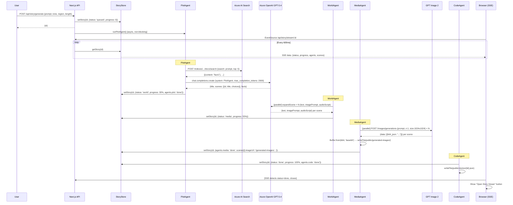
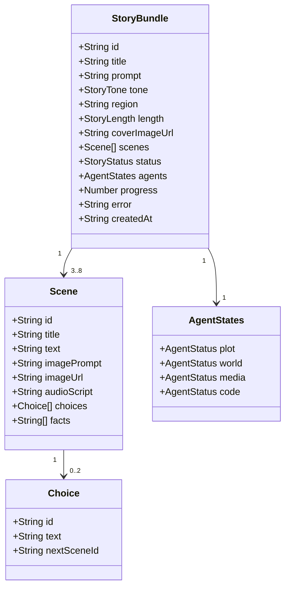
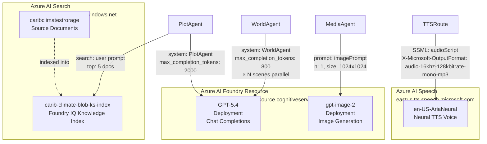
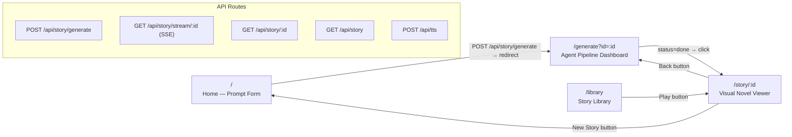

# Narrative Alchemist — System Architecture

> This document describes the full system architecture for **Narrative Alchemist**.  
> The Mermaid diagrams below can be rendered at [mermaid.live](https://mermaid.live) or imported into Archi / ArchiMate tools.

---

## 1. High-Level System Overview

```mermaid
graph LR
    subgraph Client["Browser Client"]
        HP[Home Page\nPrompt Form]
        GD[Generate Dashboard\nSSE Live View]
        SV[Story Viewer\nVisual Novel]
        LIB[Library\nStory Grid]
    end

    subgraph NextJS["Next.js 16 App Server (localhost:3000)"]
        direction TB
        GEN[POST /api/story/generate]
        STREAM[GET /api/story/stream/:id\nSSE]
        STORYAPI[GET /api/story/:id]
        TTS_API[POST /api/tts]
        PIPE[pipeline.ts\nOrchestrator]
        STORE[(StoryStore\nIn-Memory Map)]
        DISK[(public/stories/*.json\nDisk Persistence)]
        IMGS[(public/generated-images/\nLocal PNG files)]
    end

    subgraph Azure["Microsoft Azure Services"]
        AOAI[Azure OpenAI\nGPT-5.4\ncalendar-climate-foundry]
        IMG2[GPT Image 2\ngpt-image-2 deployment]
        AIS[Azure AI Search\ncarib-ai-search\nFoundry IQ Index]
        SPEECH[Azure AI Speech\neastus\nen-US-AriaNeural]
    end

    HP -->|POST prompt + tone + region + length| GEN
    GEN -->|returns {id}| HP
    HP -->|router.push| GD
    GD -->|EventSource| STREAM
    STREAM -->|poll every 600ms| STORE
    GD -->|GET| STORYAPI
    SV -->|GET /api/tts| TTS_API
    LIB -->|GET /api/story| STORYAPI

    GEN --> PIPE
    PIPE --> STORE
    PIPE --> DISK
    PIPE -->|images| IMGS

    TTS_API -->|SSML POST| SPEECH
    SPEECH -->|MP3 audio/mpeg| TTS_API
    TTS_API -->|stream MP3| SV

    PIPE --> AOAI
    PIPE --> IMG2
    PIPE --> AIS
```

---

## 2. Agent Pipeline Flow



---

## 3. Data Model



---

## 4. Azure Service Map



---

## 5. Frontend Route Map



---

## Architecture Notes for Archi / ArchiMate

When rendering this in ArchiMate / Archi, use the following layer mapping:

| Mermaid Node | ArchiMate Layer | Element Type |
|:-------------|:----------------|:-------------|
| Browser Client | Application Layer | Application Component |
| Next.js API Routes | Application Layer | Application Service |
| PlotAgent / WorldAgent / MediaAgent / CodeAgent | Application Layer | Application Function |
| StoryStore (in-memory) | Technology Layer | Artifact |
| public/ (disk) | Technology Layer | Artifact |
| Azure OpenAI GPT-5.4 | Application Layer | Application Service (External) |
| GPT Image 2 | Application Layer | Application Service (External) |
| Azure AI Search | Application Layer | Application Service (External) |
| Azure AI Speech | Application Layer | Application Service (External) |
| Azure AI Foundry | Technology Layer | Node (Cloud) |

**Relationships:**
- `PlotAgent` **uses** `Azure AI Search` (Serving)
- `PlotAgent` **uses** `Azure OpenAI` (Serving)
- `WorldAgent` **uses** `Azure OpenAI` (Serving)
- `MediaAgent` **uses** `GPT Image 2` (Serving)
- `pipeline.ts` **triggers** `PlotAgent → WorldAgent → MediaAgent → CodeAgent` (Triggering)
- `SSE Route` **accesses** `StoryStore` (Access)
- `Browser` **realizes** `User Prompt` (Realization)
